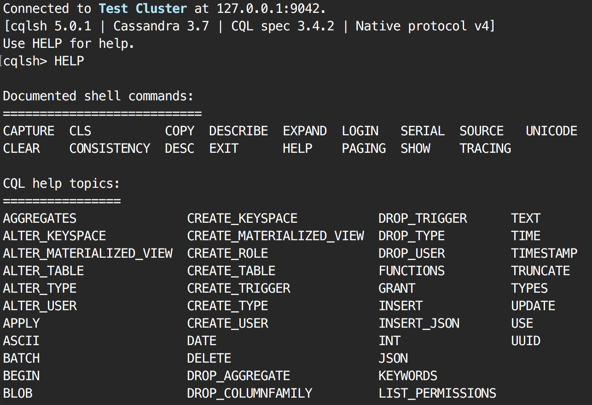
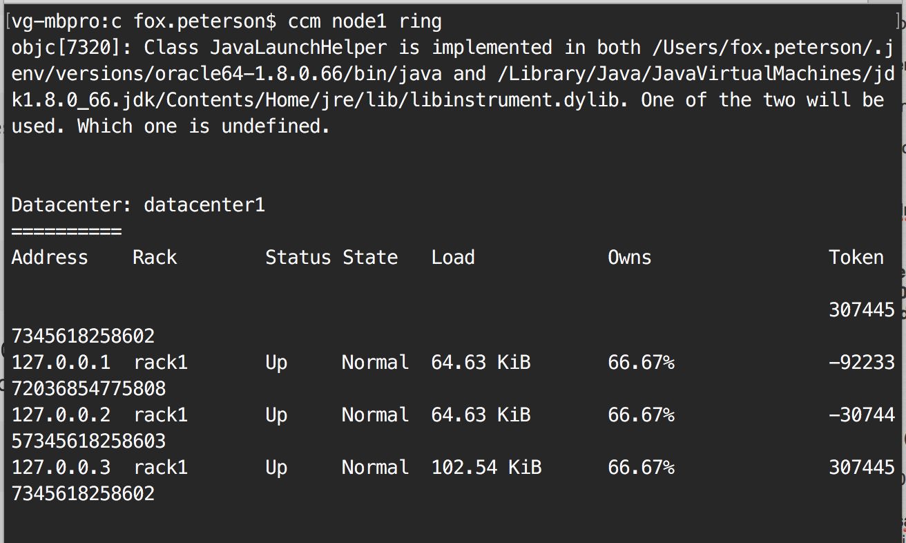
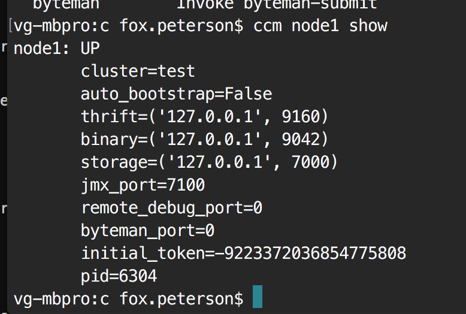
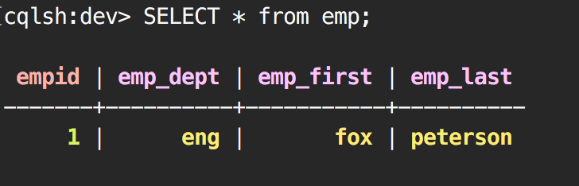
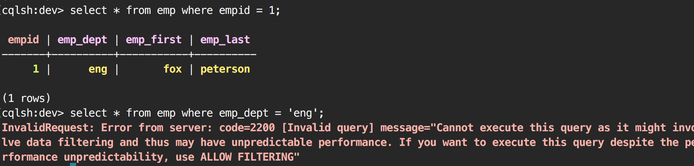
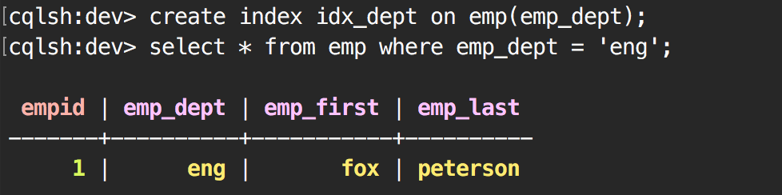

HOW TO GET CASSANDRA
====

if you have no python: 
	
		brew install python

then:

		brew install cassandra

then: 

		pip install csql

HOW TO RUN CASSANDRA
====

		cassandra -f

HOW TO RUN CSQL TO WORK IN CASSANDRA
====

	
		cqlsh

brings up CQL command line. Try it: 

		cqlsh > HELP

CASSANDRA CLUSTERS
===

Create a test cluster:

		ccm create test -v 3.7 

Use whatever version you actually have above, of course. That's cassandra version, not cqlsh version, thrift version, etc.

Populate that cluster with nodes (three nodes):

		ccm populate -n 3

You have to configure those nodes on a mac. That is, assign local host and tell them to go "up"

		sudo ifconfig lo0 alias 127.0.0.2 up
		sudo ifconfig lo0 alias 127.0.0.3 up
		sudo ifconfig lo0 alias 127.0.0.4 up

Start those nodes:

		ccm start

Try to ping a node:

		ccm node1 ring

NODE COMMUNICATION
====

Check the status of a node:

		ccm node1 show

	

CQLSH WITH THE NODE
====

I couldn't actually get this to work, but you can apparently call

		ccm node1 cqlsh

Instead, I just called 

		cqlsh

Then in the command window, typed 

		CREATE keyspace dev with replication={'class': 'SimpleStrategy', 'replication_factor':1};
		USE dev;
		CREATE table emp (empid int PRIMARY KEY, emp_first varchar, emp_last varchar, emp_dept varchar);

Now I insert myself into my table

	
		INSERT INTO emp (empid, emp_first, emp_last, emp_dept) values (1, 'fox', 'peterson', 'eng');

	

Notice how cassandra only digs the columns you've made as the primary keys

We can fix that.

